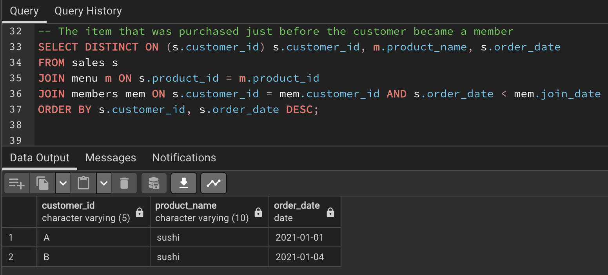
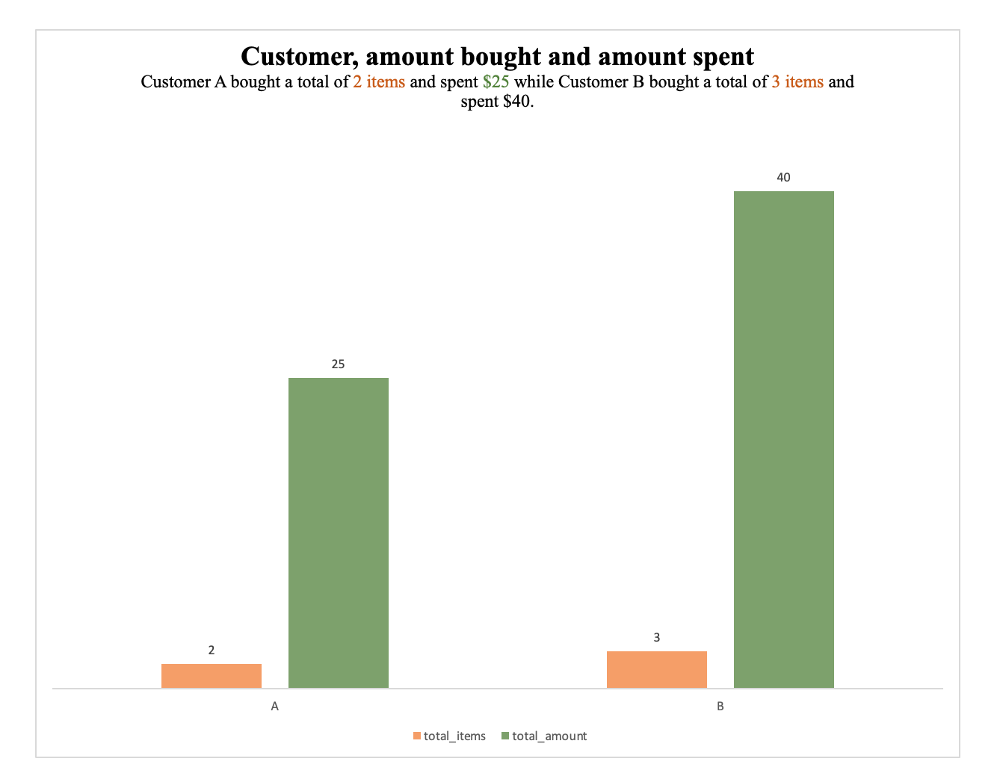

# --Customer-Insights-Analysis-Using-Sales-Menu-Members-Data
Emphasizes the comprehensive nature of your project, covering customer behaviour analysis, sales data, menu items, and the SQL queries used for analysis

## Introduction
The Danny Ma restaurant dataset was provided with three(3) files that represented our tables. We have sales, menu and members which we created in PostgreSQL and I performed data analysis using SQL. The dataset contains information about various customer IDs, order dates, product IDs, prices, product names and the join date details.

## Problem Statement
I wanted to find a way to understand the business of Danny Ma and how the products he offered were been received by customers. Figure out the relationship between price, products and customers. 
The following questions were asked and the answers were provided to questions and problems below.
1. The most purchased item on the menu and how many times it was purchased by all customers.
2. The item that was the most popular for each customer.
3. The item that was purchased first by the customer after they became a member.
4. The item that was purchased just before the customer became a member.
5. The total items and amount spent for each member before they became a member.

## Data Analysis
The analysis was done using tables that were provided. The 3 tables provided were the sales table, the menu table and the members table.  
The sales table had 3 columns; customer id, order date, and product id.  
The menu table had 3 columns; product id, product name and total area price.  
The members table also had 2 columns; customer id, and join date.  

For problem 1, The most purchased item on the menu and how many times it was purchased by all customers.  
It achieves this by joining the "sales" and "menu" tables on the "product_id" column. Then, it groups the results by the product name and counts the occurrences of each product in the sales table. Finally, the results are ordered in descending order of purchase count, and the query limits the output to the first row to get the most purchased item.

2. The item that was the most popular for each customer.  
This is done by joining the "sales" and "menu" tables on the "product_id" column. It then groups the results by both customer ID and product name and counts the occurrences of each product for each customer. By using the DISTINCT ON clause, it selects the first row for each customer based on their ID and the descending order of purchase count.  
Customer A bought ramen the most, 3 times.  
Customer B bought sushi the most, 2 times.  
Customer C bought ramen as well the most, 3 times.  

                                           

3. The item that was purchased first by the customer after they became a member.  
I joined the "sales" and "menu" tables to link purchases with products and also join the "members" table to associate customers with their join dates. The results are filtered to only include purchases where the order date is greater than or equal to the join date of the respective customer. The DISTINCT ON clause is used again to select the earliest purchase for each customer after joining.
Customer A purchased curry.  
Customer B purchased sushi.  

4.  The item that was purchased just before the customer became a member.
I joined the tables and filtered by dates, selecting the purchase with an order date that is less than the customer's join date. By using the DISTINCT ON clause and ordering by order date in descending order, the query obtains the latest purchase for each customer before joining.  
Customer A purchased sushi just before they became a member.  
Customer B also purchased sushi just before they became a member.  

5.  The total items and amount spent for each member before they became a member.  
I started by creating a Common Table Expression (CTE) called "member_purchases" that calculates the total items and total amount for each customer using the "sales" and "menu" tables, considering only purchases made before the customer's join date. Then, the main query joins the CTE with the "members" table based on the customer ID to retrieve the relevant information for each member.  
Customer A bought a total of 2 items and spent $25.  
Customer B bought a total of 3 items and spent $40.  

                                          

## Recommendations
I would identify the most purchased item on the menu which is Ramen and its purchase count. Consider promoting this popular item or creating variations that align with its characteristics. Additionally, I would also analyze the least purchased items to determine if they can be improved, repositioned, or removed to streamline the menu.  
I would personalize marketing campaigns, and send targeted offers, discounts, or recommendations based on each customer's preferences to enhance engagement and drive repeat business.  
Design membership benefits that align with these purchase patterns, such as offering discounts on the first purchase after joining or exclusive deals on items frequently purchased by members.  
Create special offers or rewards for items that were purchased first after customers joined as members.  
Recognize and reward customers who made significant purchases before becoming members. Consider offering loyalty points, early access to promotions, or personalized offers to acknowledge their loyalty and encourage them to continue their patronage.

## Conclusion
We can create a surprise to the dining experience that resonates with our diverse clientele.  
We can attract and lure our customers with tailored offers and recommendations, fostering a connection that goes beyond mere transactions.  
By validating and enhancing the value of membership, we can pave the way for a seamless transition that increases the connection between customers and the restaurant.  
Tailored experiences that cater to each customer's unique characteristics, build stronger connections and drive higher customer satisfaction.
